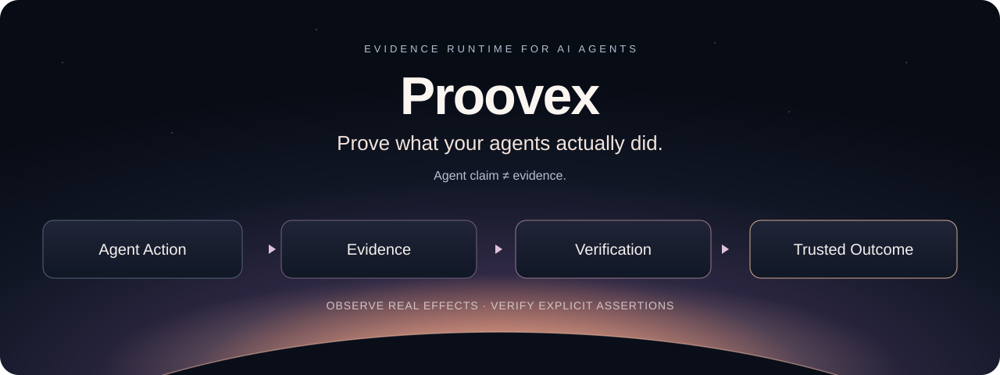

# Proovex

[English](./README.md) | 简体中文

证明你的 AI Agent 实际做了什么。

Proovex 是一个开放、可插拔、面向 AI Agent 的 Evidence Runtime。

捕获 Agent 的真实操作，观察其产生的影响，并独立验证实际发生了什么。

**当前状态：早期产品化 / 孵化阶段。独立实现尚不可用。**



## Proovex 是什么

Proovex 为 AI Agent 提供 Evidence（证据）与验证基础设施。其目标是将每次 Run（运行）与 Agent 的实际操作、真实系统中的变化，以及独立 Verification（验证）能够证明的结果关联起来。

## 为什么需要 Proovex

Agent 的输出是一种声明。Proovex 将 Agent 的执行过程转化为可验证的 Evidence。

AI Agent 的 Evidence 应将操作、观察到的副作用以及 Verifier（验证器）的结果关联起来。这样，Agent 验证就能超越自报成功，为 Agent 评估、安全和审计提供依据。

## Evidence 与 Trace 有什么区别

Trace 通常描述执行路径与时序，也可以包含有用的 Evidence。但一条工具调用记录本身，不能证明目标系统真的发生了预期变化。

Proovex 的目标是把操作记录、独立观察、来源与明确的验证断言关联起来。Verification 只证明相应断言得到现有 Evidence 的支持；它不代表整个系统安全，也不代表所有副作用都已被发现。

## 能证明什么：一个具体例子

**概念示例，不是运行结果、可执行示例或正式 schema。** 假设 Agent 声称已将一份报告保存到指定路径：

| 环节 | 需要的依据 |
|---|---|
| 声明 | Agent 报告“文件已保存” |
| 操作 | 写入指定路径的请求，关联到同一次 Run |
| 独立观察 | 在操作后读取目标文件，记录来源、时间及内容摘要 |
| Evidence | 将写入请求、观察结果与文件产物关联，保留各自来源 |
| Verification | Verifier 检查观察到的内容摘要是否与预期一致 |
| 结果边界 | 匹配只支持内容一致这一断言；不匹配应失败；缺失可信观察则保持未知 |

“Trusted Outcome”指有可追溯 Evidence 支持的具体结论，而不是对 Agent 的笼统信任。

## 核心流程

```text
Capture → Normalize → Store → Verify → Query
```

即捕获、规范化、存储、验证与查询。Collector（采集器）负责捕获 Evidence，Verifier 负责独立评估。整个流程保留 Agent 声明与实际观察结果之间的区别。缺失的 Evidence 保持未知，不能被视为成功。

## Proovex 捕获什么

计划覆盖的采集范围包括：

- 操作
- 观察结果
- 状态变化
- 副作用
- 产物
- Verification 结果

这些是目标 Evidence 类别，不代表独立 Collector 已经交付。

## 面向谁

- AI Agent，包括编程、浏览器和 MCP Agent
- RPA 与计算机使用自动化（CUA）
- 评估、安全、治理与审计集成

## 目标使用场景

以下是计划中的使用体验，不是当前可用功能：

- **编程 Agent：文件真的改了吗？** 将写入操作与独立观察到的文件内容关联，验证明确的内容断言。
- **浏览器 Agent / RPA / CUA：操作生效了吗？** 检查操作后的状态，而不把点击或工具成功返回当作结果证明。
- **评估、安全与审计：结论依据是什么？** 查询 Run 的 Evidence 和 Verification 结果，区分自报结果、观察事实及仍未知的部分。

## 原则

- 厂商中立
- 可插拔
- 独立观察
- 默认可验证
- Evidence 优先于自我报告

## 当前状态

**早期产品化。现在还不能试用独立运行时。** 本仓库提供产品定义与路线图，尚无可运行的 SDK、CLI、API 或 Quick Start。

Proovex 的 Evidence、信任、Verification 和评估能力最初在 grado-companion-kit 中开发、孵化和验证。

独立代码提取须通过单独的决策和 Work Item；本仓库不并行维护第二套运行时实现。文中描述的使用体验仍是目标，并非已交付功能。

“开放”指预期的集成接口。许可证策略尚未决定，本仓库没有授予开源许可证。

英文 README 是权威产品定义，中文版是其准确本地化。

## 愿景

阅读 [Vision](./VISION.md)，了解长期方向、独立性原则和产品边界。该文档目前为英文。

## 路线图

阅读 [Roadmap](./ROADMAP.md)，了解计划中的产品阶段及核心运行时范围之外的内容。该文档目前为英文。尚未承诺发布日期。
